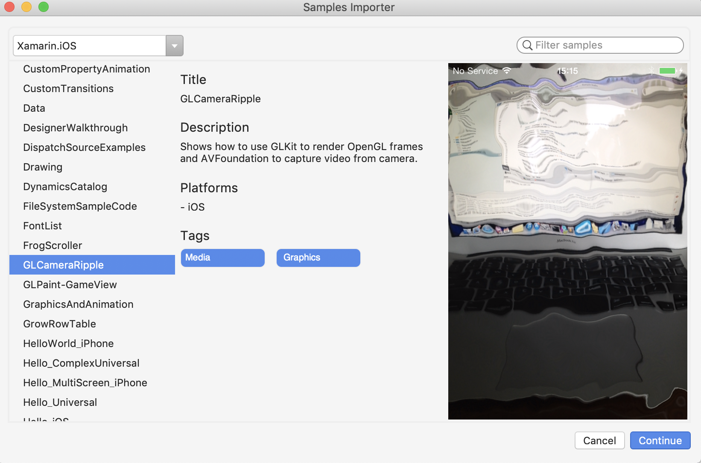

# VS4Mac Samples Importer

**Samples Importer** is a Visual Studio for macOS addin to explorer and directly open **Xamarin** samples from the IDE.

## Screenshots

    

## Copyright and license

Code released under the [MIT license](https://opensource.org/licenses/MIT).